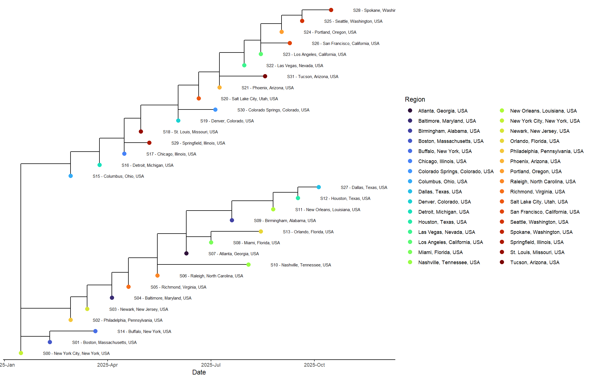
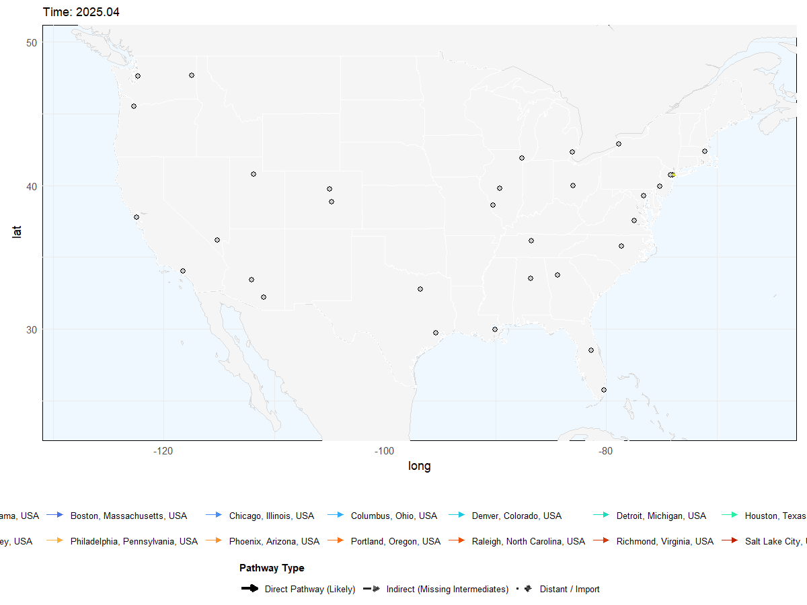
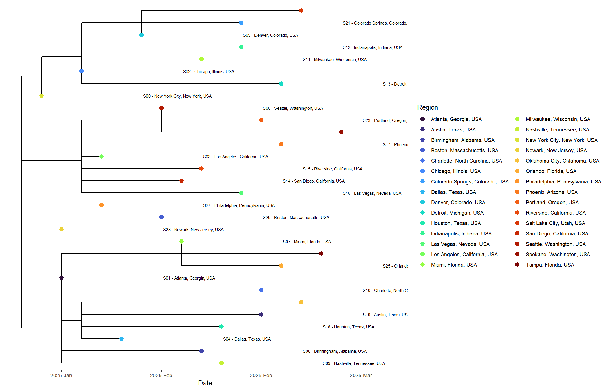
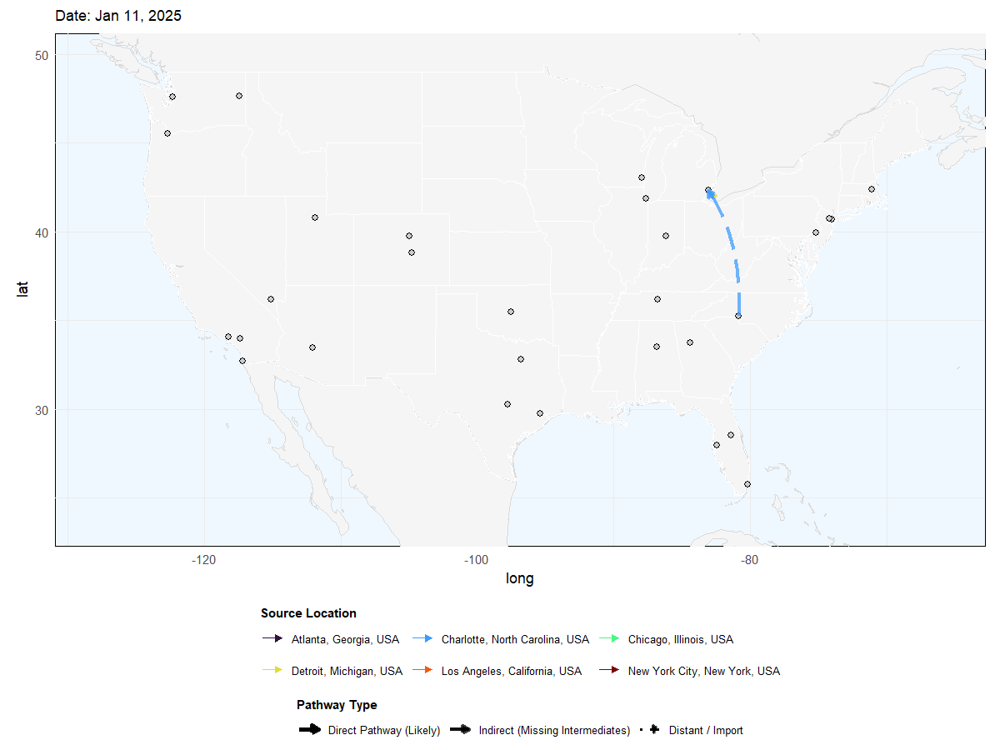
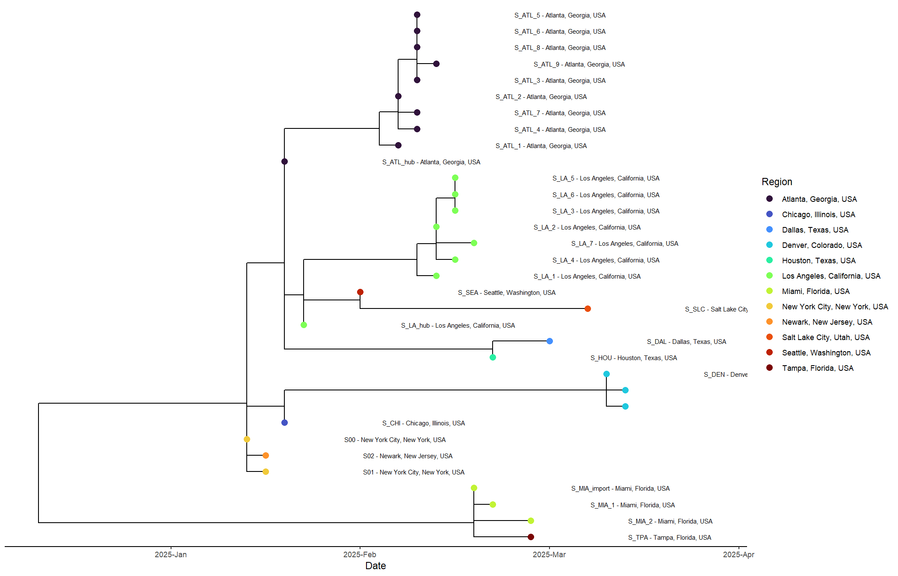
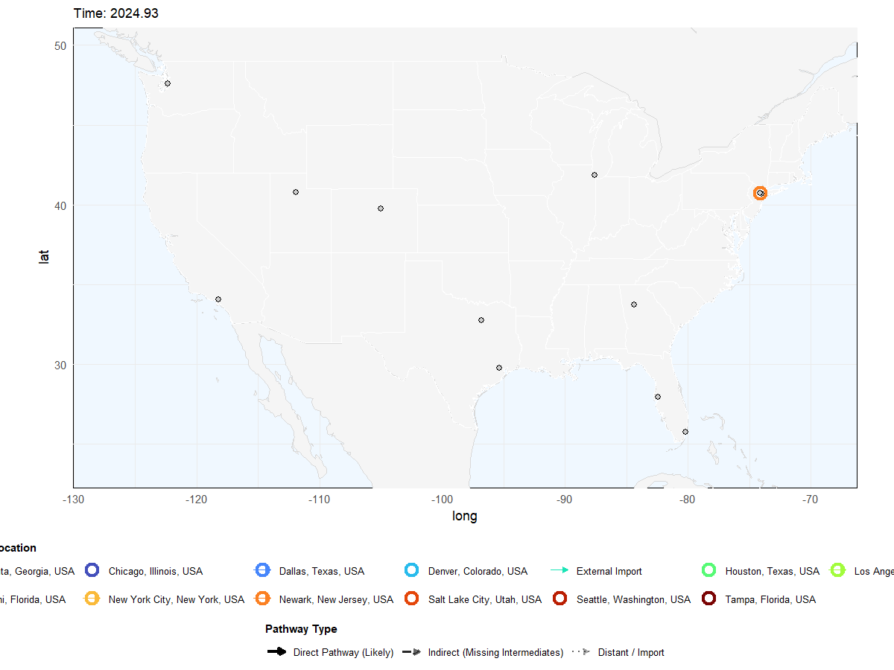

# phymapr

An R package for phylogeographic transmission mapping. Takes a time-scaled phylogenetic tree and sample metadata, reconstructs ancestral locations, infers transmission pathways, and produces animated and static geographic maps.

Works with output from TreeTime, BEAST, or anything that produces an annotated NEXUS with node dates.

## Installation

phymapr depends on ggtree and treeio from Bioconductor. Install those first, then install phymapr from GitHub:

```R
if (!requireNamespace("BiocManager", quietly = TRUE))
    install.packages("BiocManager")

BiocManager::install(c("ggtree", "treeio"))

if (!requireNamespace("remotes", quietly = TRUE))
    install.packages("remotes")

remotes::install_github("ADHS-Taylor/phymapr")
```

## Usage

```R
library(phymapr)

results <- generate_phylo_transmission(
  timetree_file = "path/to/timetree.nexus",
  metadata_file = "path/to/metadata.tsv",
  col_specimen  = "accessionVersion",
  col_date      = "sampleCollectionDate",
  col_location  = "location",
  map_style     = "polygon",
  n_prune_early = 4
)

# results$tree_plot      - time-scaled tree (ggplot)
# results$static_map     - all pathways at once (ggplot) 
# results$map_animation  - animated transmission (gganimate)
# results$episodes       - local circulation episodes
# results$pathways       - inferred transmission pathways

# Save static map
ggsave("transmission_map.png", results$static_map, width = 14, height = 10, dpi = 150)

# Save animated GIF
library(gganimate)
anim <- animate(results$map_animation, width = 1200, height = 900, res = 120, fps = 10)
anim_save("transmission_map.gif", animation = anim)
```

Location strings (e.g., "Phoenix, Arizona, USA") are geocoded automatically via OpenStreetMap on first run. Internet connection required.

## Examples

The companion repository [phymap-workflow](https://github.com/ADHS-Taylor/phymap-workflow) ships with three simulated datasets that show how increasing complexity affects the output.

### Virus X -- Sequential Domestic Spread

32 samples, 24 US cities, 10-month span. A single introduction with clear chains of transmission. Most pathways classify as direct.

| Tree | Map |
|------|-----|
|  |  |

### Virus Y -- Compressed Outbreak

30 samples, 22 cities, 2-month window. Everything happens fast. Blended pacing separates simultaneous events that would otherwise stack on top of each other in the animation.

| Tree | Map |
|------|-----|
|  |  |

### Virus Z -- Multiple Introductions

33 samples, 12 cities, 2.5 months. Several independent introductions into overlapping locations. This is where confidence classification matters. The package distinguishes direct pathways from imports and marks uncertain links as indirect.

| Tree | Map |
|------|-----|
|  |  |

## How It Works

`generate_phylo_transmission()` runs through the following stages:

1. **Data prep** -- reads the tree, parses metadata, geocodes locations, computes map bounds
2. **Tree plot** -- renders a time-scaled phylogenetic tree colored by location
3. **Ancestral state reconstruction** -- Brownian motion ASR to estimate internal node locations
4. **Epidemiologic inference** -- collapses local branches into residence episodes, identifies transitions between locations, classifies confidence based on SNP distance and temporal gaps
5. **Pacing** -- blends calendar time with rank-order to smooth out uneven sampling
6. **Map rendering** -- builds both a static cumulative view and an animated GIF

SNP thresholds auto-scale to the data when branches span different evolutionary scales. Internal nodes placed far from any real sample site get filtered to avoid phantom connections on the map.

## Parameters

| Parameter | Default | Description |
|-----------|---------|-------------|
| `timetree_file` | -- | NEXUS or Newick time-scaled tree |
| `metadata_file` | -- | CSV/TSV with specimen IDs, dates, locations |
| `col_specimen` | `"SPECIMEN_NUMBER"` | Column matching tree tip labels |
| `col_date` | `"date"` | Collection date column |
| `col_location` | `"location"` | Geocodable location string |
| `map_style` | `"polygon"` | `"polygon"` or `"tile"` (dark satellite) |
| `n_prune_early` | `4` | Drop N earliest evolutionary pathways from animation |
| `threshold_direct_snp` | `2` | Max SNPs for direct transmission call |
| `threshold_indirect_snp` | `5` | Max SNPs before import classification |
| `distant_rendering_style` | `"import_arrow"` | How imports render: `"import_arrow"`, `"pulse"`, `"curve"`, `"hide"` |
| `animation_pace_balance` | `0.5` | 1.0 = pure calendar time, 0.0 = pure rank order |

## Full Pipeline (FASTA to Map)

If you're starting from raw sequences rather than a pre-built timetree, the companion repo handles the bioinformatics side:

**[phymap-workflow](https://github.com/ADHS-Taylor/phymap-workflow)** -- one command from aligned FASTA + metadata to final map. Uses IQ-TREE for ML tree, TreeTime for molecular clock, then phymapr for visualization. No conda or Snakemake required.

```bash
python run_pipeline.py --fasta aligned.fasta.gz --metadata metadata.tsv.gz --prune
```

## Package Structure

```
R/
├── generate_phylo_transmission.R  # main entry point
├── data_prep.R                    # tree/metadata parsing, geocoding
├── tree_plotting.R                # ggtree visualization
├── asr_modeling.R                 # ancestral state reconstruction
├── epidemiologic_inference.R      # episode collapsing, pathway scoring
└── mapping.R                      # arc interpolation, map building
```
